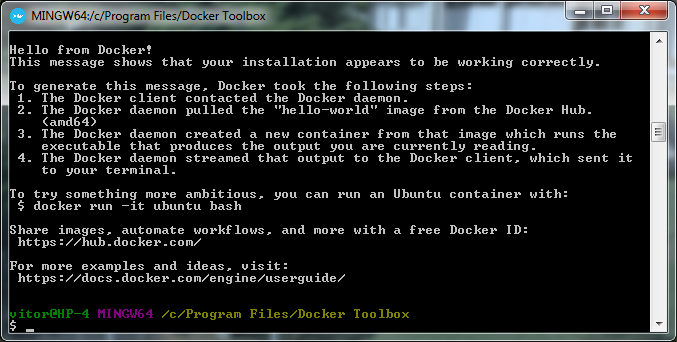

# MC9 - Docker: introdução à administração de containers

 **Evento**: [WORCAP 2018](http://www.inpe.br/worcap/2018/)  
 **Data**: 23/08/2018  
 **Horário**: 15:30 - 17:30  
 **Local**: LIT  
 
**Ministrantes:**  
- [Vitor Conrado Faria Gomes](http://lattes.cnpq.br/2864513791602949), CAP/INPE  
- [Raphael Willian da Costa](http://lattes.cnpq.br/7394226786935007), DATAINFO
- [Gilberto Ribeiro de Queiroz](http://lattes.cnpq.br/9981634193003068), DPI/INPE

**Resumo**:  
Docker é uma tecnologia que fornece virtualização em nível do sistema operacional, evitando a sobrecarga da execução de máquinas virtuais. Esses ambientes virtuais, conhecidos por *containers*, permitem o empacotamento de aplicações e suas dependências, facilitando a implantação e portabilidade de sistemas.  
Esse curso aborda o funcionamento da tecnologia Docker, a configuração de containers através de Dockerfile, o compartilhamento de imagens, a preparação de um ambiente com múltiplos containers e ferramentas para o gerenciamento de containers. O curso terá conteúdo teórico e parte prática. Durante a parte prática, os participantes irão apresender a criar e configurar containers Docker. Além disso, será criado um ambiente com banco de dados e serviço web utilizando múltiplos containers Docker. Ao final, serão indicadas ferramentas para gerenciamento de containers Docker.

# Requisitos

## 1. Instalação do Docker
Para a realização das atividades práticas do minicurso é **necessário** que o participante leve um notebook que, preferencialmente, tenha acesso a rede.  

Para o curso, é necessário instalar o **Docker** no seu computador. Siga as instruções conforme seu sistema operacional:

### 1.1 Linux

Siga as instruções conforme sua distribuição:  
  - [Ubuntu](https://docs.docker.com/install/linux/docker-ce/ubuntu/)
  - [Debian](https://docs.docker.com/install/linux/docker-ce/debian/)
  - [CentOS](https://docs.docker.com/install/linux/docker-ce/centos/)
  - [Fedora](https://docs.docker.com/install/linux/docker-ce/fedora/)
  
  
Após a instalação, não se esqueça de executar os seguintes comandos:

```bash
sudo usermod -aG docker $USER
```

### 1.2 Windows
Siga [essas instruções](https://store.docker.com/editions/community/docker-ce-desktop-windows) para instalar o Docker no seu computador. Pode ser necessário criar uma conta no Docker para fazer o download. 

> **Atenção**: Para Windows anteriores ao 10, é necessária a instalação de outra versão do Docker. Se esse for o seu caso, siga as intruções [dessa página](https://docs.docker.com/toolbox/overview/).

### 1.3 Mac OS
Siga [essas instruções](https://docs.docker.com/docker-for-mac/install/) para instalar o Docker no seu computador. Pode ser necessário criar uma conta no Docker para fazer o download. 

## 2. Testando a instalação:
Certifique-se que sua instalação foi realizada corretamente executando o seguinte comando no terminal:

```bash
docker run hello-world
```

Você deverá ver uma mensagem parecida com a apresentada na imagem abaixo.



## 3. Criação de conta no Docker Hub (Opcional)
Durante o minicurso será mostrado como compartilhar imagens de containers utilizando o Docker Hub. Para isso, será necessário que cada aluno tenha uma conta no [Docker Hub](https://hub.docker.com/). 

## 4. Docker compose

Se você tiver python e pip instalados em seu computador, vc pode instalar o docker-compose usando:
```bash
pip install -U docker-compose
```

No Ubuntu, você pode instalar usando:
```bash
sudo apt-get install docker-compose
```

Para outras situações, siga [essas instruções](https://docs.docker.com/compose/install/). 

## 4. Download do Material
Em breve !!!

<!--O curso possui material para a parte [teórica](teoria) e para a parte [prática](pratica).
Para o curso, baixe o material para o seu computador.  
Você pode fazer isso usando o git:  
```bash
git clone https://github.com/vconrado/mc9-worcap2018.git
``` 
Ou fazendo download [nesse link](https://codeload.github.com/vconrado/mc9-worcap2018/zip/master).
-->

