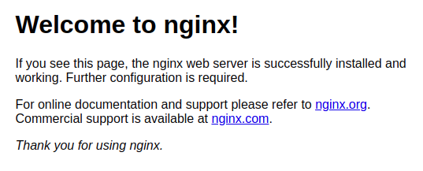

# Preparando um container com NGINX


**Objetivos**:  
    - configurar um container  
    - mapear volume  
    - salvar a imagem  
    - mais comandos  
//    - enviar para o docker hub  

**Resumo**:  
Será criado um ambiente a partir de uma imagem Ubuntu 16.04 e será instalado o servidor [NGINX](https://www.nginx.com/). 

## 1. Escolhendo a imagem

O [Docker Hub](https://hub.docker.com/) é um repositório de imagens para containers. São disponibilizadas [imagens oficiais](https://docs.docker.com/docker-hub/official_repos/) ou imagens compartilhadas por [usuários](https://hub.docker.com/u/vconrado).

## 2. Executando o container 

```bash
docker run --name nginx1 ubuntu:16.04
```
Documentação [**docker run**](https://docs.docker.com/engine/reference/commandline/run/).

Rodando o *bash* no container 
```bash
docker run -it --name nginx1 ubuntu:16.04 bash
```

Veja os processos que estão rodando no ambiente:
```bash
ps -ef
```

## 3. Instalando o ngnix
No **terminal do container**, digite: 
```bash
apt-get update
apt-get install -y nginx
/etc/init.d/nginx start
```

Para descobrir o IP do container, digite **terminal do seu computador**:
```bash
docker inspect nginx1
```

Abra o brower e aponte para o **IP do container nginx**.

---

---


## 4. Salvando a imagem do container
```bash
docker commit nginx1 nginx:1.0
```

## 5. Removendo e criando novo container com a imagem salva

Removendo ...
```bash
docker stop nginx
docker rm nginx
docker ps -a
```

Executando ...
```bash
docker run -it --name nginx2 nginx:1.0 bash
/etc/init.d/nginx start
```

Mais um ...
```bash
docker run -it --name nginx3 nginx:1.0 bash
/etc/init.d/nginx start
```

Abra o browser e confira se os dois estão funcionando.

## 6. Mapeando arquivos do host no container
```bash
docker run -it --name nginx4 -v $PWD/html/:/var/www/html nginx:1.0 bash
ls /var/www/html
/etc/init.d/nginx start
```

Saida do container digitando:
```bash
exit

## 7. Reiniciando o container
```bash
docker start nginx4
```

## 8. Vinculando ao terminal do container
```bash
docker attach nginx4
```

## 9. Saindo do container sem finalizá-lo
```bash
Ctrl+p+q
```

## 10. Executando novo terminal em container em execução
```bash
docker exec -it nginx4 bash
ps -ef
```

## 11. Próximos passos

Acesse [aqui](03-dockerfile.md) a próxima atividade.


