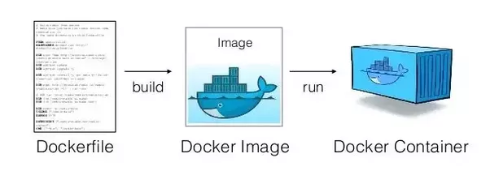

# Automatizando a criação de uma imagem com Dockerfile


**Objetivo**:  
- criar um Dockerfile  
- construir uma imagem a partir do Dockerfile  
- enviar imagem para o [Docker Hub](https://hub.docker.com/). 

## 1. Dockerfile

É um arquivo de definição de uma imagem Docker. Pode ser comparado ao *Makefile* do Docker. Ele fornece a *receita* para a construção de uma imagem Docker. O Dockerfile é usado para automatizar a configuração de *containers* e permite o compartilhamento facilitado de imagens Docker, sem a necessidade de fazer upload/download de muitos dados. 



## 2. Estrutura Básica

```bash
FROM ubuntu:16.04

RUN apt-get update \
    && apt-get install -y nginx

COPY html/index.nginx-debian.html /var/www/html/

CMD ["bash"]
```

- **FROM**: indica a imagem de referência;
- **LABEL**: adiciona um metadado a uma imagem;
- **RUN**: executa o comando indicado;
- **COPY**: copia o arquivo indicado para o sistema de arquivos do *container*;
- **CMD**: indica o comando padrão a ser executado quando o *container* for iniciado. Pode ser sobrescrito caso o *container* seja executado com algum comando.

Documentação do [Dockerfile](https://docs.docker.com/engine/reference/builder/)


### 2.1 Gerando a imagem do container
Entre na pasta onde conter o Dockerfile exemplo:

```bash
cd mc9-worcap2018/pratica/Dockerfiles/nginx
```
Execute o comando **build** para produzir a imagem:

```bash
docker build --tag nginx:1.1 .
```
Documentação [**docker build**](https://docs.docker.com/engine/reference/commandline/build/).

### 2.2 Executando um container com imagem criada
```bash
docker run -it --name nginx5 nginx:1.1
```
Iniciando o nginx:
```bash
/etc/init.d/nginx start
```

## 3. Dockerfile servidor PostgreSQL


> Arquivo: pratica/Dockerfiles/postgresql/Dockerfile


```bash
FROM ubuntu:16.04
LABEL maintainer="Vitor Gomes <vconrado@gmail.com>"

EXPOSE 5432

ENV PG_PASSWORD=dbpass

VOLUME /var/lib/postgresql/data

RUN apt-get update \
    && apt-get install -y sudo postgresql-9.5 \
    && apt-get clean && rm -rf /var/lib/apt/lists/* /tmp/* /var/tmp/*

COPY files/entrypoint.sh /entrypoint.sh

ENTRYPOINT  ["/entrypoint.sh"]
```
- **EXPOSE**: expõem uma porta do *container* para ser acessível do lado externo;
- **ENV**: variável de ambiente disponível durante o build e a execução do *container*;
- **VOLUME**: mapeia um diretório ou volume do host para ser acessível pelo container;
- **ENTRYPOINT**: informa comando que será executado quando o *container* for iniciado. Ele não pode ser sobrescrito e será executado sempre.

### 3.1 Construindo a imagem

Execute o comando **build** para produzir a imagem:

```bash
docker build --tag pg:1.0 .
```
### 3.2 Rodando

```bash
docker run -it --name pg pg:1.0
```

## 4. Volumes

Volumes podem ser utilizados para armazenar dados que não podem ser perdidos com a remoção do Docker. 

O mapeamento de volumes no Docker pode ser feito via pastas (como fizemos no exemplo com nginx) ou através de volumes gerenciados pelo Docker. 


### 4.1 Listando e removendo volumes
Para verificar os volumes existentes, digite:
```bash
docker volume ls
```

Para remover os volumes, digite:
```bash
docker volume rm id_do_volume
```

### 4.2 Criando um volume
Para criar um volume com nome **pg_data**, digite:
```bash
docker volume create pg_data
```

### 4.2 Executando um container associado ao volume criado
```bash
docker run -it --name pg -v pg_data:/var/lib/postgresql/data  pg:1.0
```

Vamos fazer um teste, criando um *database* e uma tabela. Para isso, digite:
```bash
sudo -u postgres createdb worcap
sudo -u postgres psql -U postgres -d worcap -c "CREATE TABLE minicurso (id INT, name CHARACTER VARYING);"
sudo -u postgres psql -U postgres -d worcap -c "INSERT INTO public.minicurso (id, name) VALUES (1, 'mc9');"
sudo -u postgres psql -U postgres -d worcap -c "SELECT * FROM  public.minicurso;"
```

### 4.3 Removendo (somente) o container

Saia do *container*
```bash
exit
```
Remova-o:
```bash
docker rm pg
```

O volume **pg_data** ainda existe:
```bash
docker volume ls
```

### 4.4 Criando um novo container com o volume
```bash
docker run -it --name pg2 -v pg_data:/var/lib/postgresql/data pg:1.0
```
Testando se os dados ainda existem:

```bash
sudo -u postgres psql -U postgres -d worcap -c "SELECT * FROM  public.minicurso;"
```

## 5. Subindo a imagem para o Docker Hub

### 5.1 Login
Inicialmente é necessário logar-se no Docker Hub, para isso, digite:
```bash
docker login
```

e insira seu usuário e senha.

### 5.2 Tag

Para subir sua imagem para o Docker Hub, é preciso incluir o seu usuário no nome da imagem. Para isso, utilize:
```bash
docker tag pg:1.0 seu_user/pg:1.0
```

Para conferir:

```bash
docker images
```

### 5.3 Enviando

```bash
docker push seu_user/pg:1.0
```

> Para conferir, abra o Docker Hub [https://hub.docker.com/u/**seu_user**](https://hub.docker.com/u/seu_user).

### 5.4 Deslogando (Opcional)

Para deslogar, basta usar 
```bash
docker logout
```

## 6. Próximos passos

Acesse [aqui](04-pg_ws.md) a próxima atividade.
