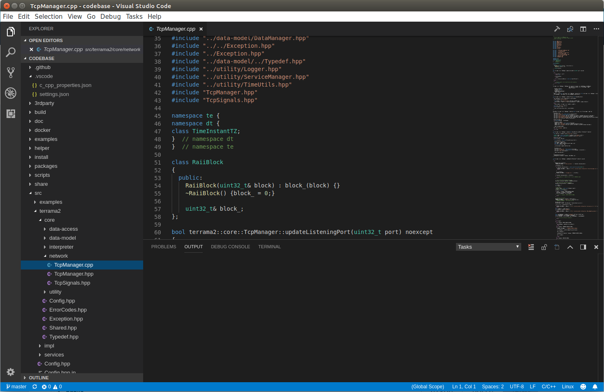

# Preparação de ambientes de desenvolvimento dos projetos TerraMA²



Site: www.terrama2.dpi.inpe.br
Repositório: https://github.com/TerraMA2/terrama2.git
Créditos: Desenvolvedores TerraMA²

## 1. Gerando imagem

```bash
git clone https://github.com/TerraMA2/terrama2.git
cd terrama2/docker/dev
docker build -t "terrama2/dev:4.0.7" .
```

## 2. Executando container

```bash
docker run -itd --name terrama2_dev -v /tmp/.X11-unix:/tmp/.X11-unix -e DISPLAY=$DISPLAY -v ~/mydevel:/home/terrama2/devel terrama2/dev:4.0.7
```

## 3. Passos finais

Compilação das dependências e execução do Visual Studio code

```bash
docker exec -it terrama2_dev bash
cd ~/scripts
chown -R ~/ terrama2:terrama2 ~/
./prepare_terralib.sh
# ./prepare_terrama2.sh
```

```bash
# Disable XServer authority checking
xhost +
# Execute Visual Studio Code
docker exec -it terrama2_dev code
```

Criando um arquivo executavel `Ambiente.desktop`:


```bash
nano ambiente.desktop
chmod +x ambiente.desktop
```

```
[Desktop Entry]
Version=1.0
Name=TerraMA2 VSCode Development
Comment=Open Docker container with built-in TerraMA2 environment
Exec=sh -c "docker start terrama2_dev && xhost + && docker exec -it terrama2_dev code && xhost -"
#Icon=code
Terminal=true
Type=Application
Categories=Utility;Development;
```
